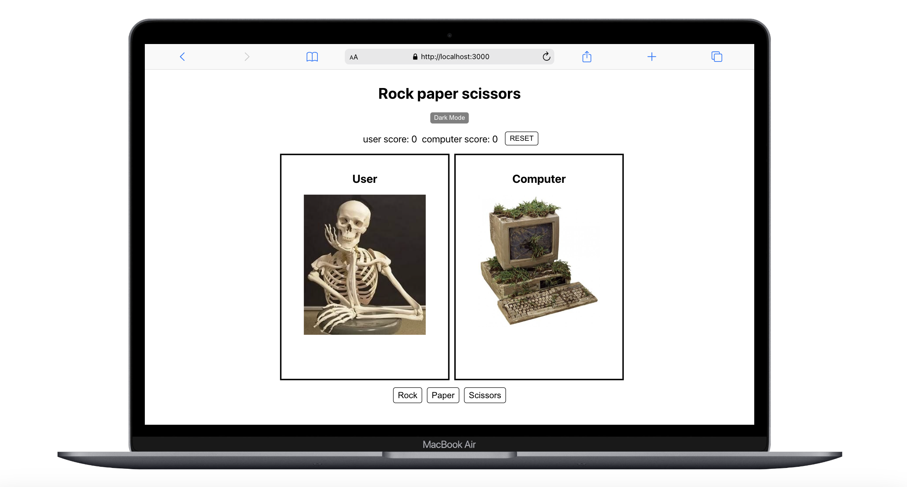
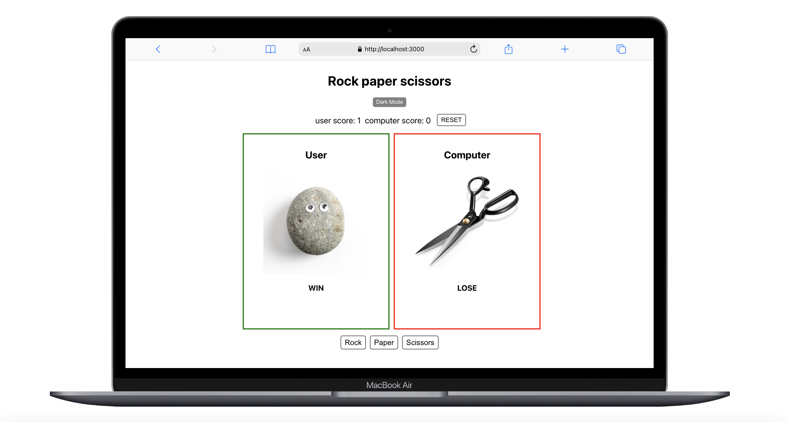
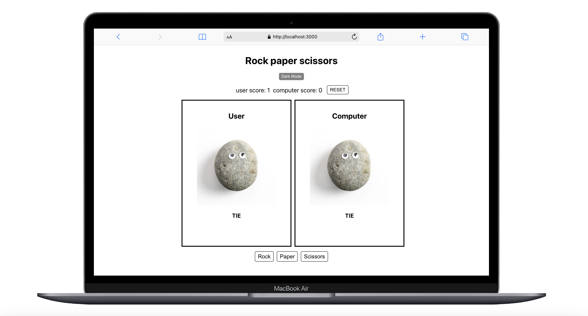
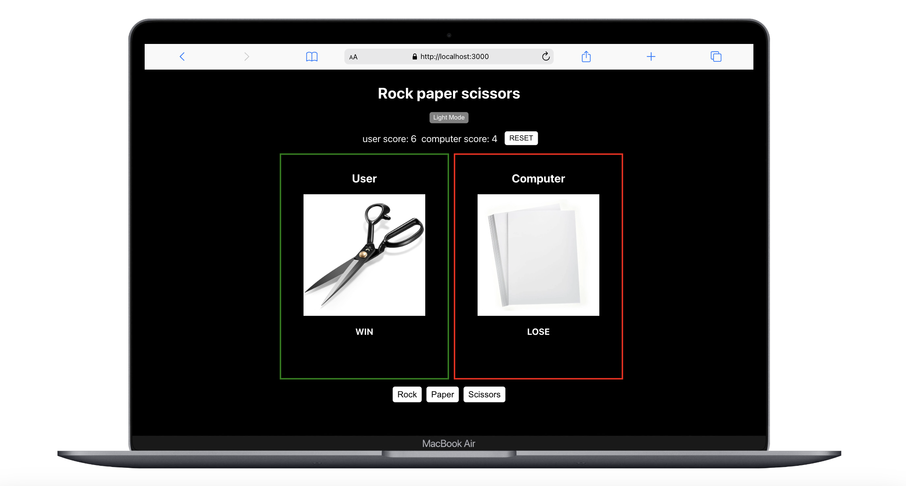

# rock-paper-scissors-v2

Rock-Paper-Scissors game built with React app

## 📌 Overview

A simple Rock, Paper, Scissors game.

- The user can choose between `Rock`, `Paper`, or `Scissors`.
- The computer randomly selects one as well, and the outcome is determined.
- Scores are updated automatically.
- A `Dark Mode` feature is included, allowing the user to toggle the theme.

## 🌐 Website

You can try the game live here: [Live Demo](https://rock-paper-scissors-v2-ivory.vercel.app)

## 📸 Screenshots

